# Final Pcomp project - LED matrix with a *twist*.

Originally I set out to create an IOT LED matrix. However, after some thought I considered this project idea to be more of a programming based than practical.  Instead, I decided to create a series of led strips attached to servos on a board. This would allow near 180 degrees of motion of each strip of 6 RGB individually addressable LEDs.

### Inspiration

Flip dot displays

Daniel Rozin's mechanical mirrors

### Motivation
Obviously a key aim for this project was to become more proficient with actual physical electronic components as opposed to staying in my comfort zone of software forever. However I also wanted to have a dynamic and interactive piece of art for my bedroom so I wanted it to be as aesthetically pleasing as possible. Additionally, I viewed this as an experimental adaption to the classic LED matrix; I was curious to investigate what kind of effects the extended rotational motion would yield. 
## The process 

So my original plan was to have 32 servos each with a horn featuring 6 equally spaced spokes. Each spoke would then contain an led strip of length 3. They would be hexagonally arranged as I discovered this was the most efficient way to pack circles. These servos would be all stuck onto a peg board. The leds I bought were 144/m individually addressable WS2812B rgb strips.

To better illustrate this I created a software prototype:  [https://jsfiddle.net/smithwrinch/krLobcx8/1/](https://jsfiddle.net/smithwrinch/krLobcx8/1/)

TODO: insert proto1
<!--  -->

So I set out to begin soldering the 800+ joints required. I imagined this would work by using just one strip and threading the input of the next strip of 3 with the out of the next strip of three and back around such that each servo would just operate one strip. However, I quickly realised this would be a much more difficult task than I thought. The LEDs were very close together and as a result the soldering was significantly more fiddly than I had anticipated. As a result of this I decided to change my design and have just one spoke of 6 LEDs per servo. This cut down the amount of soldering required to a reasonable level.

This new software prototype can be seen here:
[https://jsfiddle.net/smithwrinch/6145bd08/1/](https://jsfiddle.net/smithwrinch/6145bd08/1/)

After hours of failed attempts I managed to get a decent workflow for soldering the strips. What worked best for me was to cut off the strip early such that there were two copper contacts to solder onto, and then scratch them with a crafting knife to enable the solder to stick.

The next challenge was to find a way of strengthening the joints as they were very fragile and would no doubt break when being moved by the servo. I experimented with a few processes and found using epoxy resin over electrical tape to work the best since it hardened to form a structure, instead of just binding the materials like superglue.

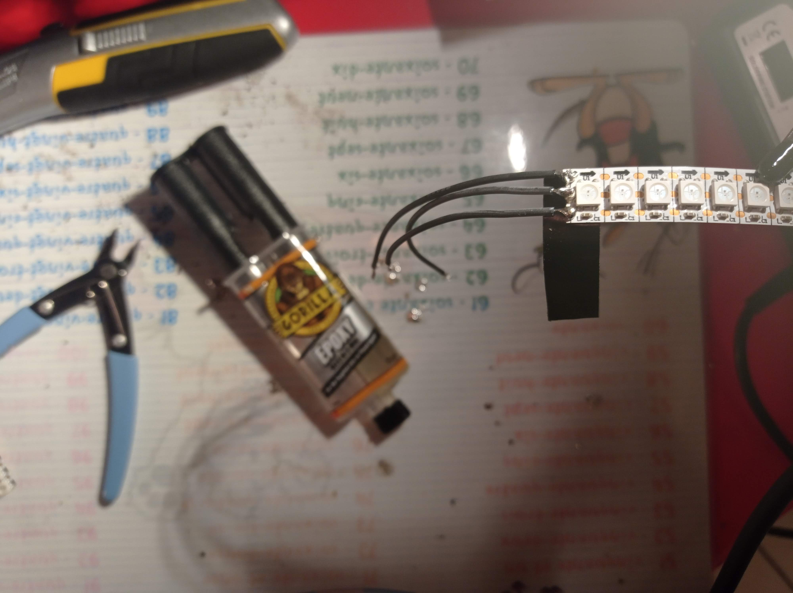

Now I had to find a way to mount the servos on the peg board. The servos would be controlled by two pca9685 drivers, each controlling 16. The peg board's hole were too limiting how much the servos could turn. It also would make the wiring for the strips too difficult without some more depth.

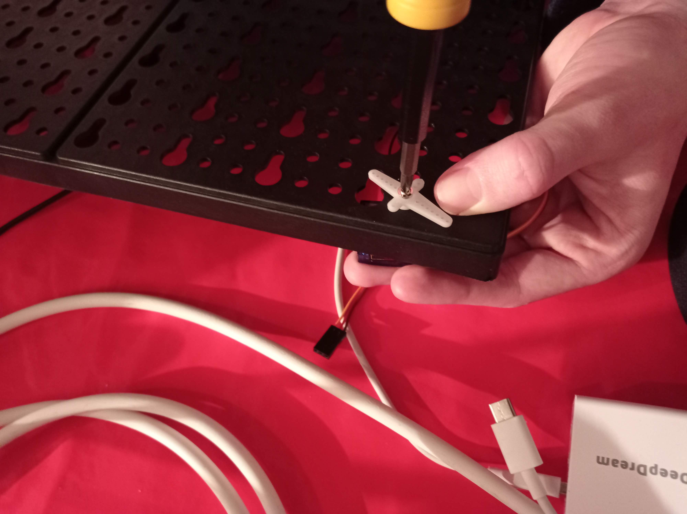

I had to use a drill to open up each one. Additionally I drilled a path for the wires from the led strip to move between such that there was less stress on the solder joints. I also sanded it.

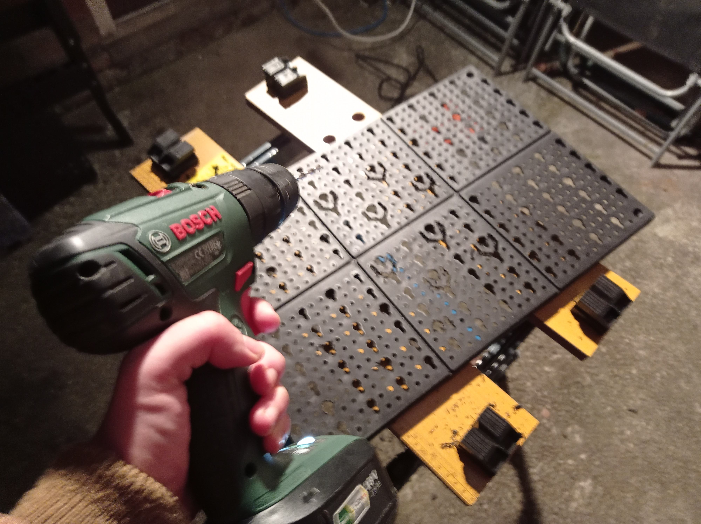
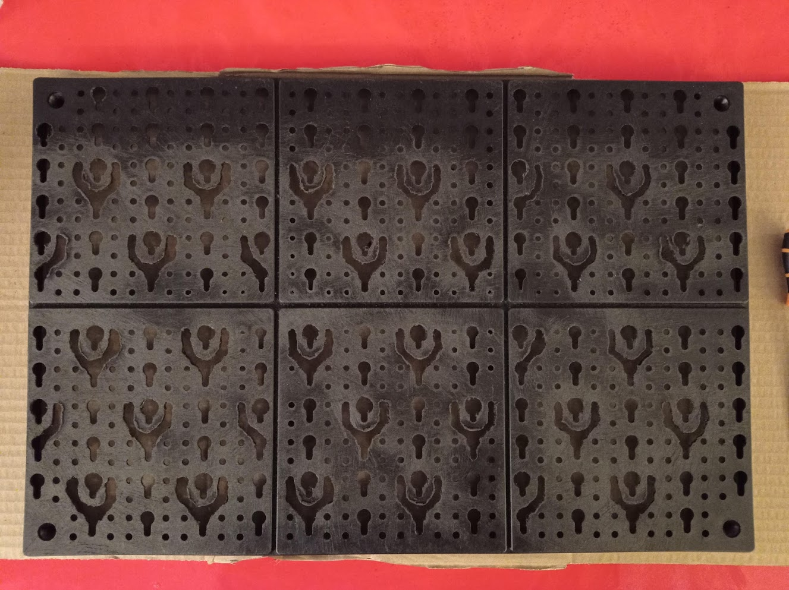

I realised the paths for the strip wires were also too narrow so, outside, I went through them with a soldering iron using a tip I didn't mind disposing.

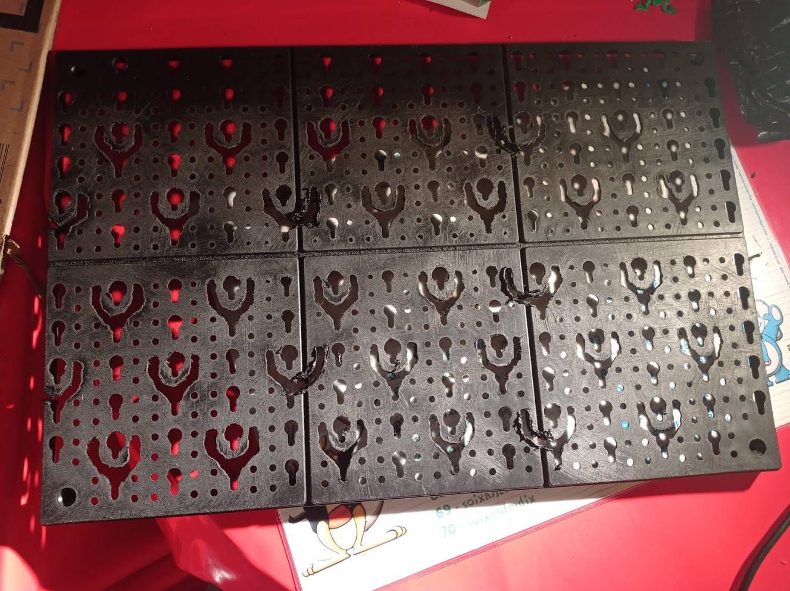

Before sanding the pegboard down again I needed to find a way to attach the strips onto the servos. I bought a piece of acrylic and cut it down into small rectangles. 

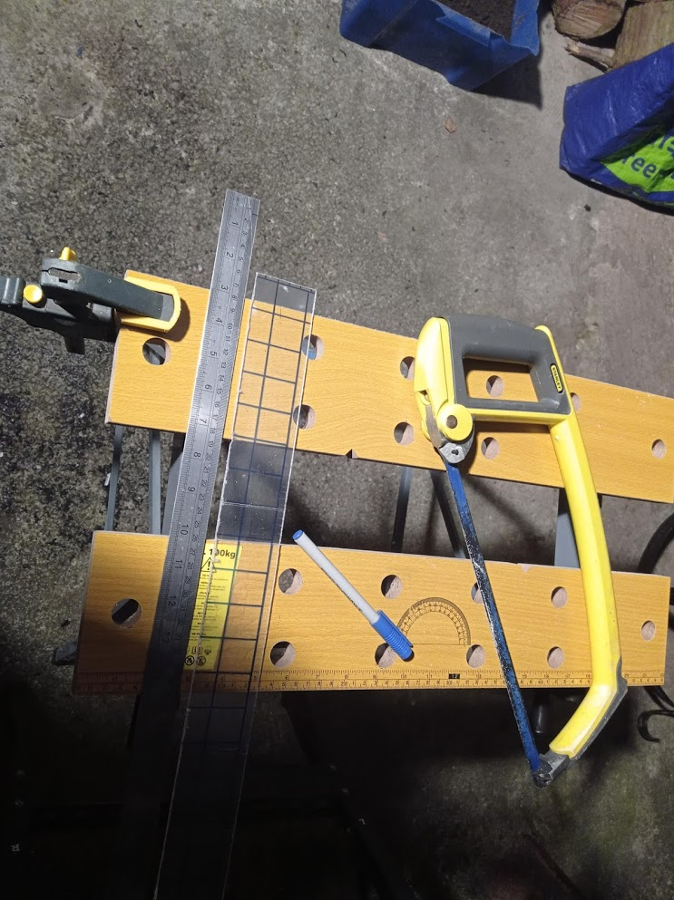

I then superglued a servo horn onto each piece.

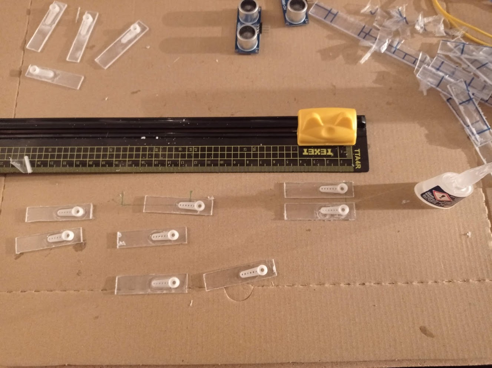

Then I attached the strips using double sided tape onto each horn. Now I could place everything together.

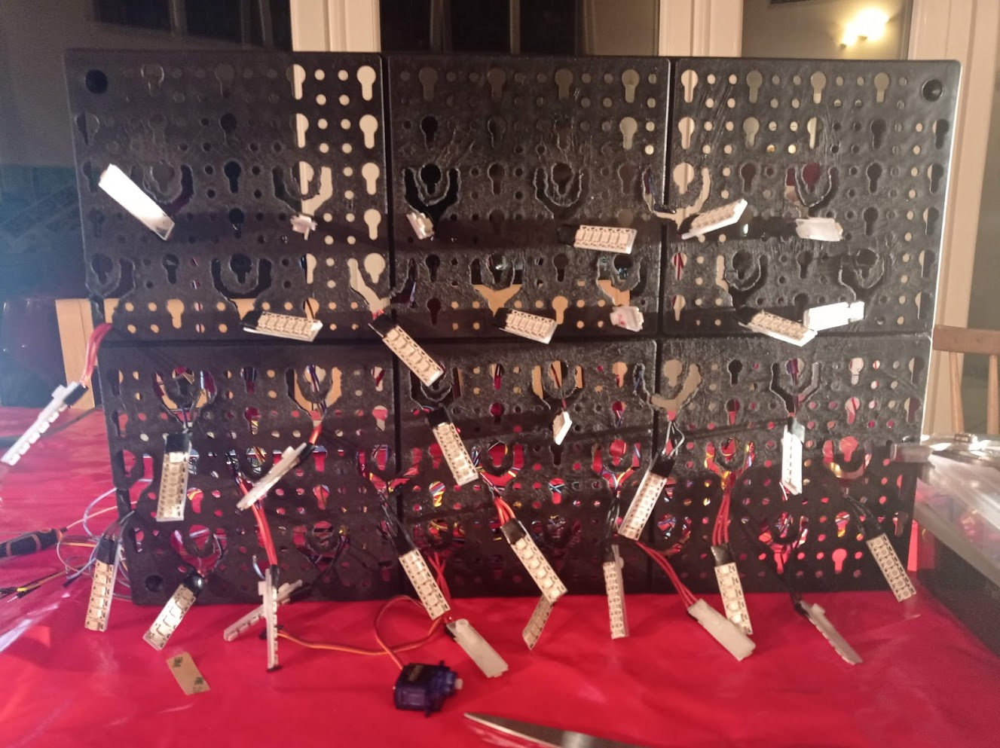
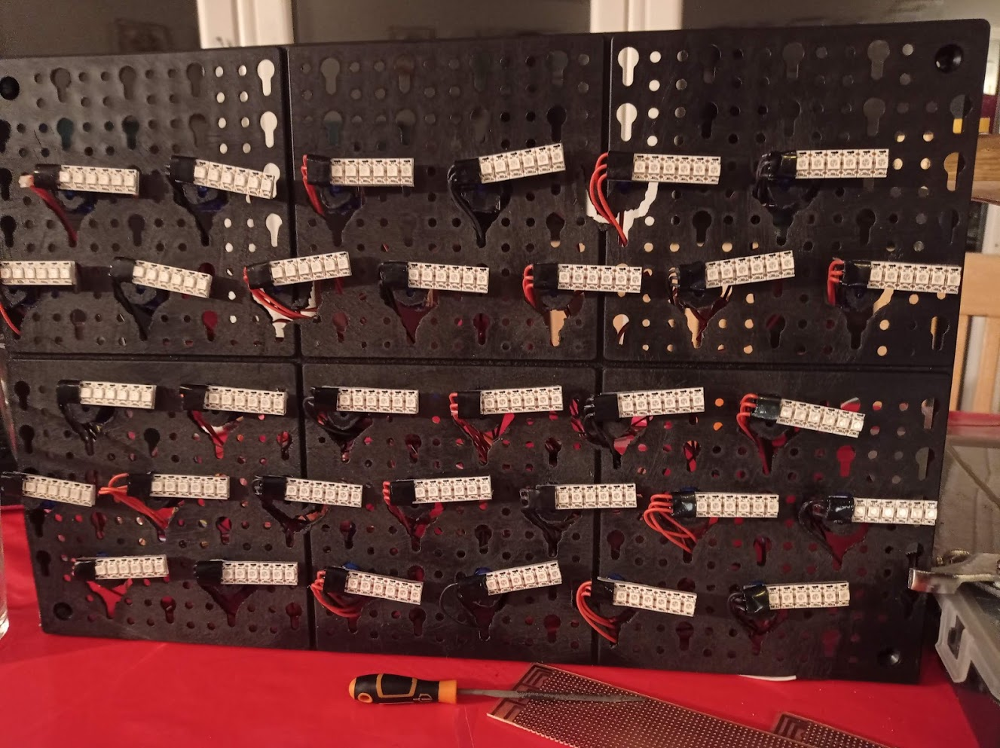

To power the system I bought a 6A 5V power supply. I used a spare plug to attach it to, but I had to replace the fuse.

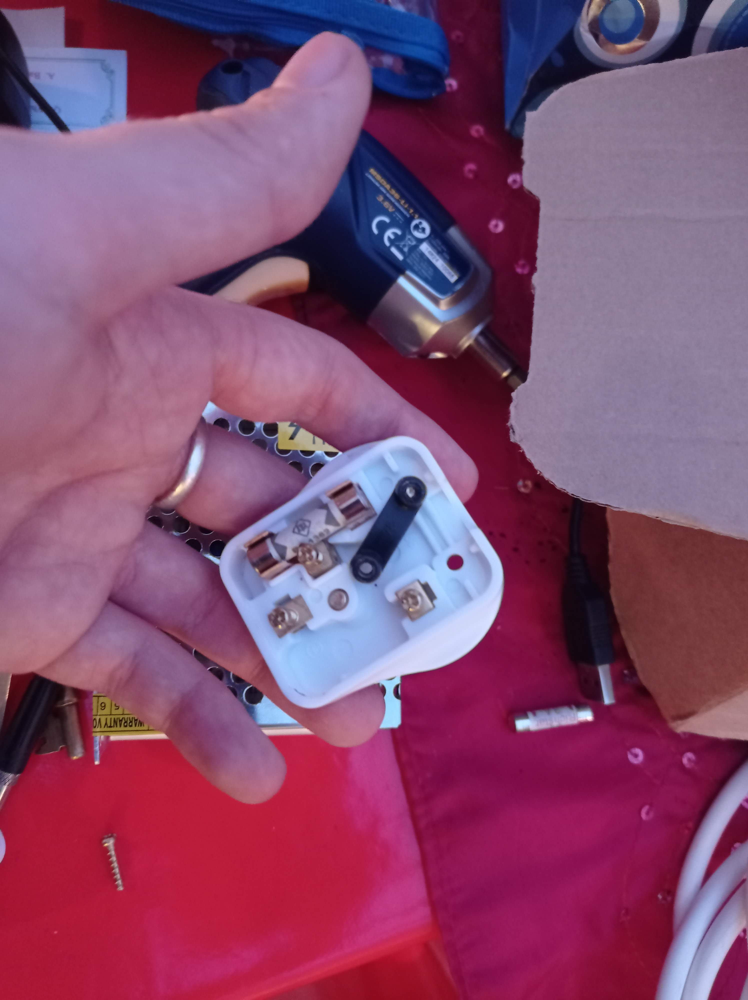

I build the enclosure using hardwood and I used the remaining of the acrylic to be able to see my labour of love at the back.

The modes are controlled using a potentiometer at the side to keep with the turning aesthetic.

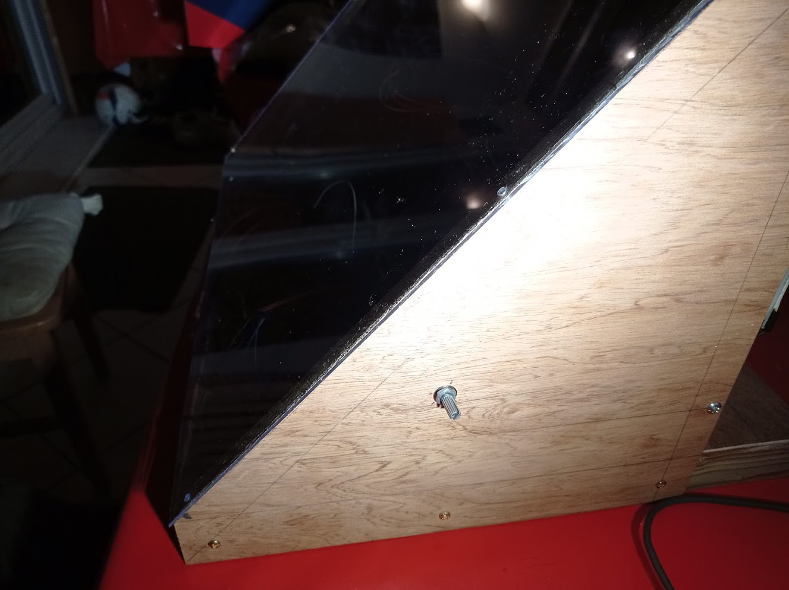

The sonar detectors were added angled at the front and there was a layer added underneath to fit the wires through to the back.

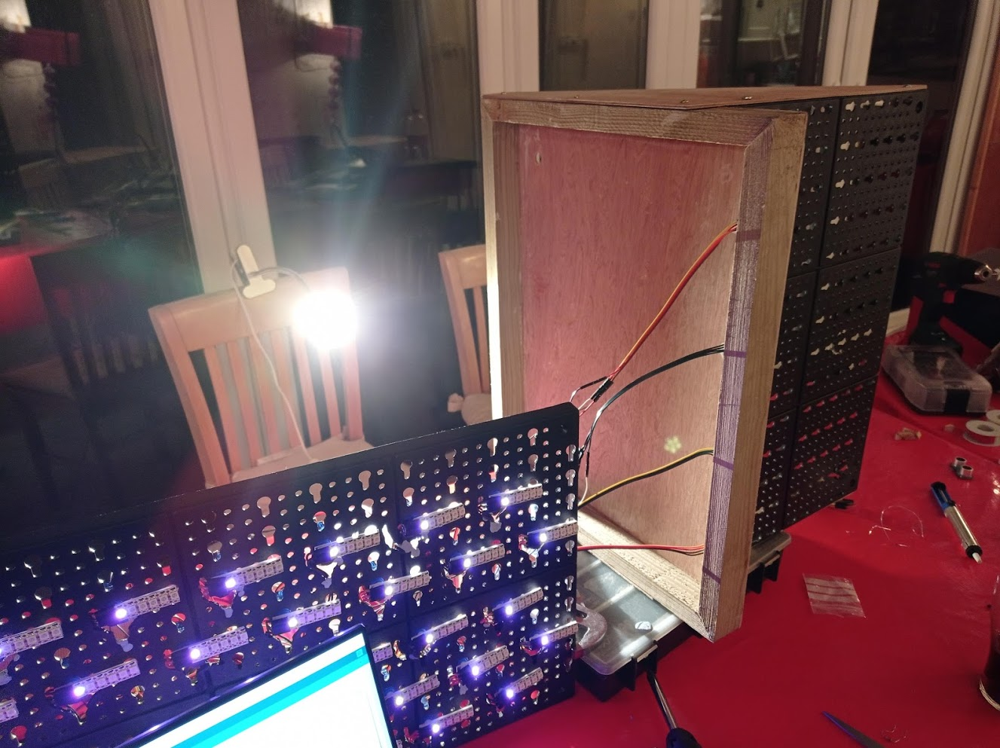
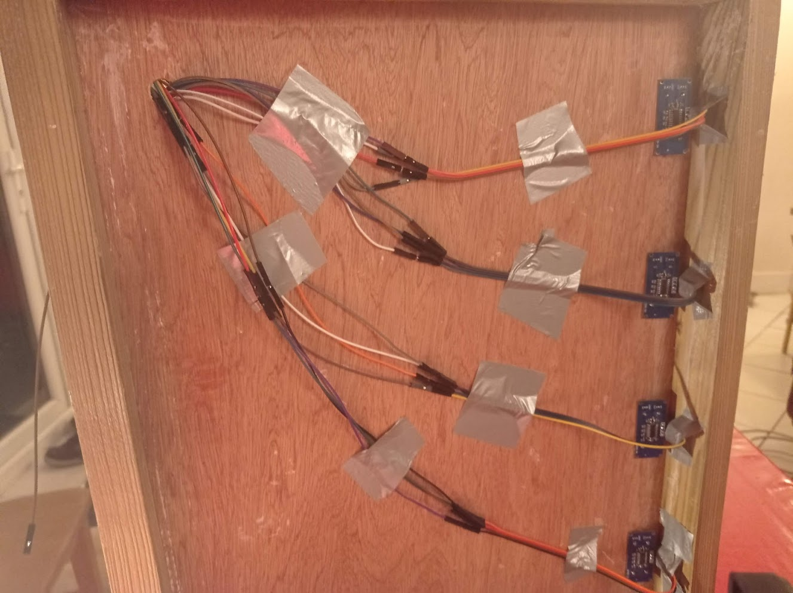

## Features

### Circuit Diagram

### Dance mode
A short dance showcasing some of the movement the system allows.

### Game Of Life
Slightly adapted for a hexagonal grid as opposed to a cartesian one. If the cell is alive it is green and upright, if it is dead it is read and to it's side. 

### Real Time Clock
The hours are represented on the left as blue. Each of the 30 other strips represent two minutes each and they turn when the condition is met.

### Sonar
Originally I wanted the spokes to all turn to the direction of the hand given an xy coordinate. However, I found it much too inaccurate and instead opted for a left/right or upright approach. You can change the hue by increasing the height of the hand.

## Evaluation
This took me over 100 hours in total and it was a lot more work than I had anticipated. I am happy with the final design of the system but I think there was more to be done programmatically. 

## Future work

- Revamp the clock so that it utilises the rotation more
- Have the sonar move to the hand with a more fluid dynamic
- Add more dances and fix delays